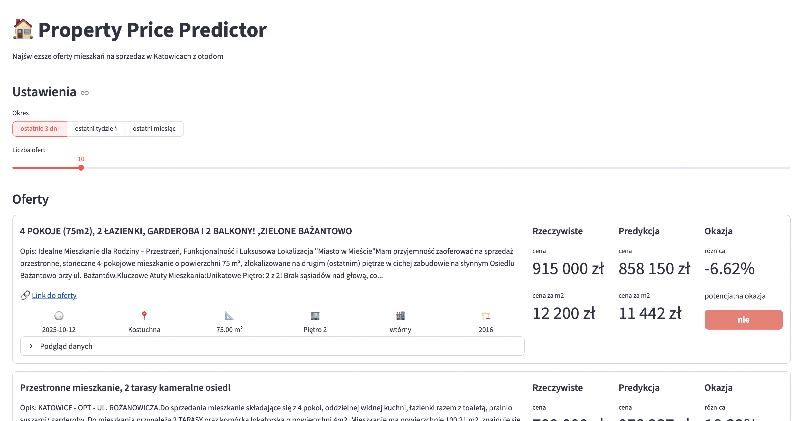

# property-ai-lab

Property AI Lab is an end-to-end, production-style machine learning project for real-estate analytics. 

It covers the ml  lifecycle — from PostgreSQL data ingestion and feature engineering to XGBoost model training, MLflow experiment tracking, and Streamlit deployment for interactive predictions.

The system predicts property prices and evaluates whether a listing is an underpriced opportunity (“bargain detection”) using real market data.All training runs are automatically tracked in MLflow, including hyperparameters, evaluation metrics, model artifacts, and feature metadata, making it easy to compare experiments and reproduce results.

The project structure follows modern MLOps best practices, with modular code, YAML configuration files, and a clean separation between data, model, and application layers.

## Features
📓 MLflow experiments, params, metrics, artifacts, and model logging

🧪 Models: XGBoost

🧰 Makefile shortcuts: start MLflow server, train models, run app

🖥️ Streamlit inference UI: price per m² + total price + is bargain prediciton

## Streamlit app
This is a **screenshot from the Streamlit inference app** used in this project.  
The app loads the model from MLflow and returns both **price per m²** and **total price** based on the entered property features.

### 💻 Interface Modes
There are two interface modes available:

1. **Automatic mode** – displays listings scraped from the Katowice area (see the <a href="https://github.com/ncola/otodom_scraper" target="_blank" rel="noopener noreferrer"> otodom scraper repository</a>) along with model predictions, basic property information, and active links to the original offers.

  

 

2. **Manual mode** – allows users to enter custom property data and get an instant price prediction and bargain evaluation

  

 

## Data source

This project reads listings from my <a href="https://github.com/ncola/otodom_scraper" target="_blank" rel="noopener noreferrer"> otodom-scraper</a>,
which scrapes Otodom and stores data in PostgreSQL.

- The training pipeline loads data via `src.data.database.service.TrainingDataService`,
  which connects through `src/data/database/db_setup.py`.

## Makefile
- `make run-server` – start MLflow server (http://127.0.0.1:5002)
- `make xgb` / `make xgb-tune` – train models
- `make app-manual` – run Streamlit UI (manual version) (http://localhost:8503)
- `make app-automatic` – run Streamlit UI (automatic version) (http://localhost:8504)

------------------------------------------------------------------------------------

