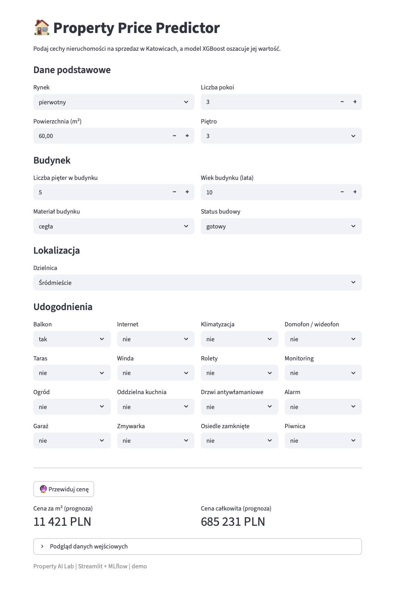

# property-ai-lab

End-to-end workflow for training real-estate price models (LightGBM / CatBoost / XGBoost) with MLflow tracking + a Streamlit app for inference (price per m² and total price).

## Features
📓 MLflow experiments, params, metrics, artifacts, and model logging

🧪 Models: LightGBM, CatBoost, XGBoost

🧰 Makefile shortcuts: start MLflow server, train models, run app

🖥️ Streamlit inference UI: structured inputs, price per m² + total price

## Streamlit app
This is a **screenshot from the Streamlit inference app** used in this project.  
The app loads the model from MLflow and returns both **price per m²** and **total price** based on the entered property features.

  

 

## Data source

This project reads listings from my <a href="https://github.com/ncola/otodom_scraper" target="_blank" rel="noopener noreferrer"> otodom-scraper</a>,
which scrapes Otodom and stores data in PostgreSQL.

- The training pipeline loads data via `src.data.database.service.TrainingDataService`,
  which connects through `src/data/database/db_setup.py`.

## Makefile
- `make run-server` – start MLflow server (http://127.0.0.1:5002)
- `make xgb` / `make lgb` / `make cat` – train models
- `make app` – run Streamlit UI (http://localhost:8501)

------------------------------------------------------------------------------------

