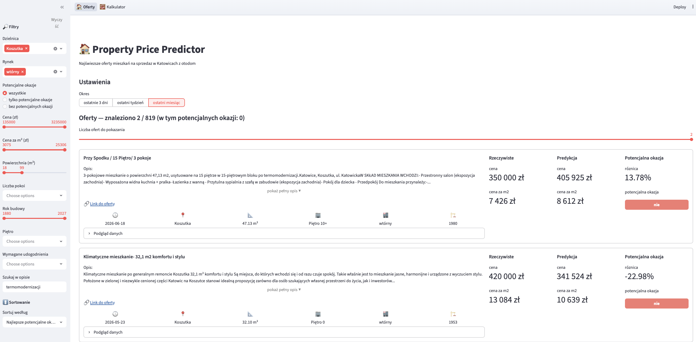

# property-ai-lab

## 🏡 About

Property AI Lab is an end-to-end machine learning project for real-estate price prediction in Katowice.

The project loads apartment listings from a Neon Postgres database, prepares model features, trains an XGBoost regressor, tracks experiments in MLflow, and serves predictions through a Streamlit app.

The Streamlit app has two pages:

- **Oferty** - shows recent Otodom listings from the database, adds model predictions, compares predicted and listed prices, and marks potential bargains. Sidebar filters (district, market, price, m², area, rooms, build year, floor, amenities, free-text search in description), sorting, and a one-click "clear filters" button.
- **Kalkulator** - lets users enter custom apartment parameters and get an instant price estimate.



## ✨ Features

🗄️ Neon Postgres data access through SQLAlchemy repositories

🧹 Feature engineering and preprocessing pipeline

🧪 Model: XGBoost with optional hyperparameter tuning

📓 MLflow experiments, params, metrics, artifacts, plots, and model logging

🖥️ Streamlit inference UI: recent offers with bargain mark + manual price calculator

🔎 Rich filtering, sorting, and description search on the offers view

🐳 Docker setup for MLflow and the Streamlit app

✅ Pytest coverage for preprocessing and feature preparation

## 📂 Project Structure

```text
app/
  streamlit_app.py          # streamlit entrypoint
  views/
    offers.py              # recent offers view
    calculator.py          # manual calculator view
src/
  data/                    # preprocessing, feature prep database access
  pipelines/               # training scripts
  serving/                 # inference pipeline
  utils/                   # metrics and MLflow helpers
configs/
  config.yaml               
  config
tests/                     # unit tests
```

## ⚙️ Configuration

Copy `.env.example` to `.env` and fill in Neon and MLflow credentials:

```bash
cp .env.example .env
```

Required Neon environment variables:

- `DB_HOST`, `DB_NAME`, `DB_USER`, `DB_PASSWORD`, `DB_PORT`, `DB_SSLMODE`

Required MLflow environment variables:

- `MLFLOW_TRACKING_URI`
- `MLFLOW_TRACKING_USERNAME`, `MLFLOW_TRACKING_PASSWORD` when using authenticated remote tracking, for example DagsHub

Model training and inference settings live in `configs/config.yaml`.

## 🚀 Local Usage

Install dependencies:

```bash
pip install -r requirements.txt
```

Start MLflow locally:

```bash
make run-server
```

Train the XGBoost model:

```bash
make xgb
```

Run hyperparameter tuning before the final training run:

```bash
make xgb-tune
```

Run the Streamlit app:

```bash
make app
```

The app runs at http://localhost:8501.

## 🐳 Docker Usage

Build and start the MLflow server and Streamlit app:

```bash
make docker-build
make docker-up
```

Services:

- MLflow: http://localhost:5002
- Streamlit app: http://localhost:8501

Stop services:

```bash
make docker-down
```

## 🧪  Tests

```bash
pytest
```

## 🗄️ Data Source

The project expects apartment listings collected by the related [otodom-scraper](https://github.com/ncola/otodom_scraper) project and stored in Neon Postgres.

Training data is loaded through `src.data.database.service.DataService`, using the database connection configured in `src/data/database/db_setup.py`.

---


